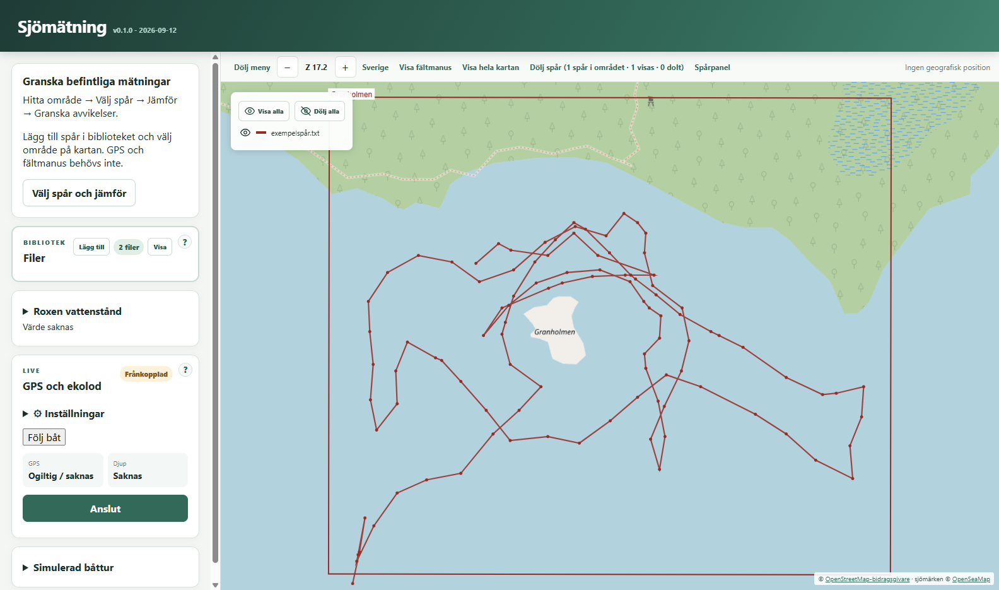
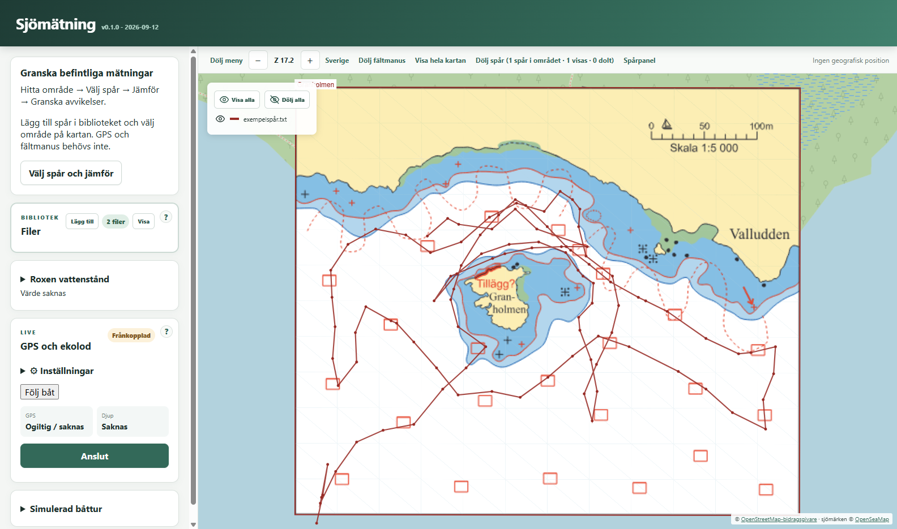

# Sjömätning

En Windowsapp för att samla in, visa och jämföra djupmätningar, med Roxen som utgångspunkt.

## Funktioner

- **Karta och fältmanus:** översiktskarta från OpenStreetMap/OpenSeaMap samt lokala PDF-, WCI- och KAP-kartor. BSB-index importerar tillhörande KAP-filer. GeoPDF läses automatiskt; vanliga PDF-manus kan kalibreras med referenspunkter.
- **Filbibliotek:** importera filer eller hela mappar med filväljare eller drag-and-drop. Filer och kalibrering sparas mellan omstarter; identiska filer importeras bara en gång.
- **Mätspår:** läs TXT, CSV, SeaClear TRC och Lowrance SL2/SL3. Visa flera körningar samtidigt med djupfärger, egna spårfärger och klickbar legend. Stora spår visas med zoomanpassat punkturval.
- **Djupkorrigering:** hämta Roxens vattennivå för mätdagen, med filnamnets nivå som reserv. Justera vattennivå, djupoffset och gallring per spår. Granska beräkning och vattennivåkälla.
- **Spårjämförelse:** jämför aktuellt kartutsnitt, alla påslagna spår eller ett eget urval. Se matchningsandel, median och spridning för djupskillnader och granska matchningarna på kartan.
- **Punktredigering och export:** ändra koordinater och rådjup eller ta bort punkter i arbetskopian. Exportera spår till CSV eller SeaClear waypoint-TXT. Importerade originalfiler behålls oförändrade.
- **GPS och ekolod via USB:** NMEA 0183 med GGA/RMC och DPT/DBT. Visa båt, position, fart och kurs över grund, med följ-båt-läge och separat status för GPS och djup. GPS fungerar även utan ekolod.
- **Mätning och återställning:** anslutning och mätstart är separata. Spara NMEA-logg och CSV löpande, markera gamla instrumentvärden och återställ kompletta CSV-rader från avbrutna sessioner vid nästa start. Återanslutning sker manuellt.
- **Simulator:** prova en båttur på Roxen med eller utan ekolod och med valbar hastighet på simuleringen.
- **Anteckningar:** placera och redigera text i fältmanus, spara automatiskt och exportera en ny PDF med anteckningarna.
- **Windowsinstallation och uppdateringar:** installationsprogram och automatisk hämtning av nya versioner, med versionsnummer och byggdatum i appen.

Kartbakgrund och hämtning av vattenstånd kräver internet. Lokala fältmanus kan visas utan nätverk. Kart- och instrumentstödet omfattar vissa formatvarianter; fysisk instrumentkompatibilitet behöver fortfarande verifieras.

## Kom igång

1. Lägg till fältmanus och mätspår via **Bibliotek → Lägg till**, eller dra in filer/mappar.
2. Välj **Gå till plats** för ett manus. Saknas geodata, kalibrera med minst två diagonalt placerade referenspunkter; tre eller fler möjliggör affin kalibrering.
3. Öppna **Spårpanel**, välj spår och använd **Jämför synliga spår** för att granska skillnader. GPS och fältmanus krävs inte för jämförelsen.
4. För mätning på sjön: välj baudrate och eventuell givarjustering i **GPS och ekolod**, klicka **Anslut** och sedan **Starta mätning**. **Stoppa och spara spåret** behåller USB-anslutningen för nästa körning.

Prova **Simulerad båttur** för att testa mätflödet utan instrument. Simulerade spår märks tydligt och innehåller påhittade mätvärden.

CSV kan återimporteras och stöder GPS-punkter utan djup. Waypoint-TXT-export tar endast med punkter med djup. NMEA-loggen sparar mottagna textrader med normaliserade radslut och metadataheader; den är inte en byteexakt kopia av dataströmmen.

## Skärmbilder

Samma mätspår vid Granholmen, utan respektive med fältmanus:





## Föreslagna nästa steg

1. **Verifiera ett helt arbetsflöde i fält.** Prova import → jämförelse → redigering → export → återimport, och en riktig båttur med GPS/ekolod, USB-avbrott och omstart. Dokumentera instrument och inställningar som fungerar.
2. **Spara uppgifter om varje mätning.** Båt, operatör, instrument, antenn-/givaravstånd och vattennivåreferens gör körningar från flera båtar lättare att jämföra och felsöka.
3. **Gör mätintervallet inställbart.** Välj hur ofta GPS-punkter sparas, exempelvis efter tid eller sträcka, med tydlig skillnad mellan insamling och efterföljande gallring.
4. **Förbättra kartarbetet.** Visa kalibreringsfel, tillåt redigering av kartgränser och byt automatiskt mellan lokala kartor när båten förflyttar sig. Utöka därefter med PNG/BMP och fler verifierade kartvarianter.
5. **Lägg till waypoints och planerade mätlinjer.** Spara fristående punkter och rutter för att planera nästa körning och se vilka områden som behöver kompletteras.

På längre sikt finns aktiv ruttnavigation, loggbok, flera instrumentanslutningar, vind/kompass/AIS, fler import- och exportformat samt nattläge och språkstöd kvar från [SeaClear-jämförelsen](seaclear2.txt). Full SeaClear-kompatibilitet är inte uppnådd. NMEA över nätverk, NMEA 2000 och fler sjöars vattenstånd kan utredas separat utifrån behov.

## Utveckling och bygge

### Webbplats

Webbversion med Cloudflare-lagring, personliga åtkomstnycklar och manuell spårplanering finns i `web/`. Se [webbdokumentationen](web/README.md) för behörigheter, lokal körning och driftsättning. Starta lokalt med `npm run web:dev` efter databasinitiering.

Krav: Node.js 22 eller senare.

```powershell
npm install
npm start
```

```powershell
npm test
npm run lint
npm run make
```

Windowsinstallationen, blockmap och `latest.yml` hamnar i `out/`. Riktade Electron-tester finns som `npm run test:<område>-ui`, där område är `navigation`, `annotations`, `feedback`, `library`, `seaclear` eller `map`. Vissa kräver lokala provfiler i `testdata/`.

[Windows- och Macbygge](.github/workflows/windows.yml) kör tester, syntaxkontroll och bygge vid push till `main`, pull requests mot `main` och manuell körning. Endast push till `main` publicerar en GitHub Release, efter att både Windows- och Macbygget har lyckats. Båda plattformarna får samma version och byggdatum; releasen innehåller Windows-installation, DMG och ZIP för Mac. Versionen sätts automatiskt till `0.2.<körningsnummer>` och byggdatum till dagens UTC-datum; ingen manuell version eller tagg behövs.

Installerade appar söker uppdateringar vid start och var tionde minut, hämtar dem i bakgrunden och erbjuder omstart för installation. Tokenfri uppdatering kräver ett publikt GitHub-repo. Windowsbyggena är ännu inte kodsignerade och kan därför ge en SmartScreen-varning.

### macOS

[Macbygge](.github/workflows/macos.yml) kör tester, syntaxkontroll och paketering på macOS som del av det gemensamma Windows- och Macbygget vid push till `main` och pull requests mot `main`. Det kan också köras separat manuellt. Bygget skapar en universell app för både Intel och Apple Silicon och kontrollerar båda arkitekturerna samt appens ad hoc-signatur.

Hämta DMG-filen från **GitHub → Releases → senaste versionen → Assets**. Testbyggen finns även via **GitHub → Actions → välj en lyckad körning → Artifacts**. Packa upp artefakten, öppna DMG-filen och dra Sjömätning till Applications. En ZIP med appen ingår också. Det gemensamma byggflödet publicerar Mac-filerna tillsammans med Windows-filerna. Separata manuella Macbyggen sparar bara artefakter.

Bygg lokalt på en Mac med `npm ci` och `npm run make:mac`. Filerna `Sjomatning-<version>-mac-universal.dmg` och `.zip` hamnar i `out/`.

Detta är testbyggen med ad hoc-signatur, utan Apple Developer-certifikat eller notarisation. macOS kan därför blockera appen vid öppning. Apple-signering och notarisation återstår för smidig distribution; automatisk Mac-uppdatering ingår inte i detta byggflöde. Programmet, särskilt fysisk GPS/ekolodsanslutning, behöver verifieras på en Mac.

## Mer dokumentation

- [SeaClear-kartor: formatstöd och begränsningar](docs/seaclear-kartor.md)
- [Lowrance SL2/SL3: formatstöd och begränsningar](docs/ekolodsformat.md)
- [Anteckningar och PDF-export](docs/anteckningar.md)
